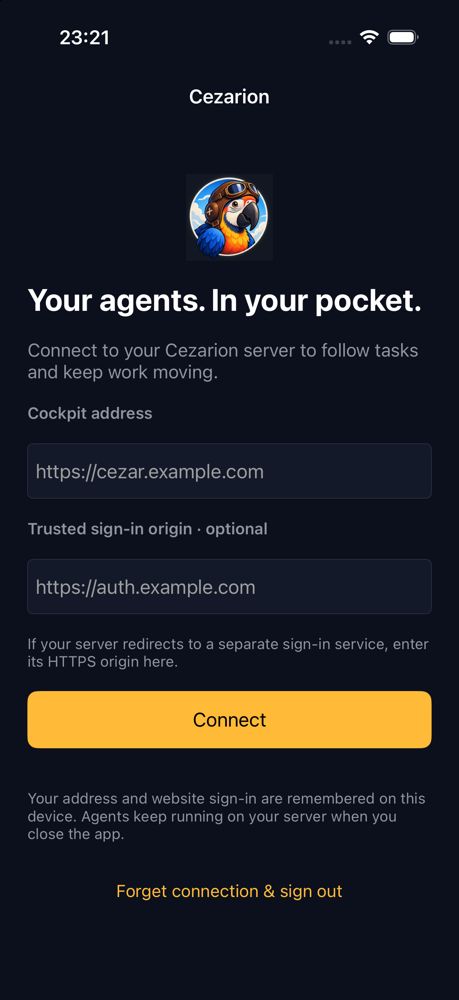
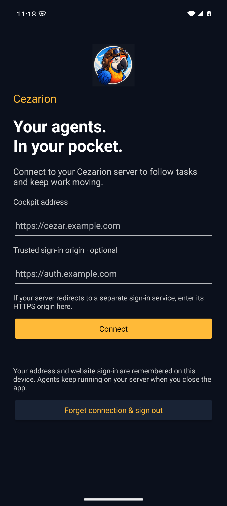
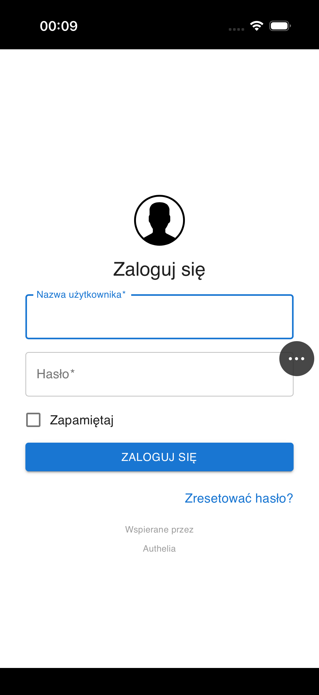

# Mobile companion validation — 2026-10-05

Tested the new `packages/mobile` source on base `a6ac6a46` with Xcode 27, an
iPhone 17 Pro simulator (iOS 26.4), JDK 17, and a Pixel 7 Android 15 emulator.
The server, contract, API client, and web application sources are unchanged.

## Mobile checks

| Check | Result |
| --- | --- |
| Android `testDebugUnitTest` | 3 passed: HTTPS, exact-origin/port matching, credential rejection, trusted sign-in origin |
| Android `connectedDebugAndroidTest` | 4 passed: HTTP rejection, real cookie deletion, compact connection menu, system Back and top-edge refresh without hijacking nested scrolling |
| Android `lintDebug assembleDebug` | Passed; installable personal APK produced |
| iOS `xcodebuild test` | 4 unit tests and 5 UI tests passed, including real cookie deletion, Back/Forward and same-document history, movable controls, top-edge refresh, nested scroll protection, and live sign-in |
| iOS network smoke | Supplied cockpit redirected to the explicitly trusted Authelia origin; sign-in form rendered |
| Android network smoke | Installed APK, entered the same supplied origin pair, and verified the Authelia sign-in form rendered |
| iOS Release archive/export | Signed development archive and IPA exported using the operator's existing local Apple team |
| iOS signature verification | `codesign --verify --deep --strict` passed |
| Physical iPhone | Version 0.1.0 installed and launched on an iPhone 14 Pro running iOS 26.6.2 after developer-profile trust |
| Diff hygiene | `git diff --cached --check` passed; no signing keys, profiles, personal server URLs, or build outputs staged |

The native UI checks also cover a recoverable connection failure, return to the
launcher, HTTPS rejection, and forgetting saved state. The screenshots below show
the clean launchers. Network screenshots containing private hostnames remain local.

| iPhone | Android |
| --- | --- |
|  |  |

No credentials were entered during automated verification. Authenticated task
creation, message sending, MFA, device background/resume behavior, and file upload
still need the operator's signed-in device smoke test described in
[the installation guide](../../docs/mobile.md#connect-and-test). Store distribution
is not exercised.

The first GitHub Android job also passed and its downloaded APK signature verified.
The first GitHub iOS job compiled but had not started a test after eight minutes
when a newer commit cancelled it. CI now explicitly boots and waits for the chosen
simulator, runs tests serially, and bounds startup/test steps. That exact boot and
serial-test command passed locally: six tests passed and the optional network test
was skipped. Both mobile CI jobs then passed for `1b3d3096`.

## Fullscreen controls follow-up — 2026-10-06

The uncommitted follow-up on `1b3d3096` removes the permanent native toolbar and
uses a movable 44pt/48dp control that opens the current origin, history, refresh,
and connection settings on demand. iPhone native edge recognizers navigate Back
and Forward; Android retains system Back. Refresh starts only at the top edge,
preserves the cockpit route, and never fires from ordinary nested-panel scrolling.

The cockpit's existing `overscroll-behavior: contain` is load-bearing for its
panels but suppresses WebKit's built-in history gestures. The new edge test failed
with that built-in gesture and passed with native edge recognizers, including
Forward and same-document `pushState`/`popstate`. No web CSS or server changes are
needed. All nine iOS tests passed, including the supplied remote sign-in flow;
all seven Android tests passed, along with lint and APK build. Release archive
compilation also passed. Test-only iPhone page responses are excluded from Release.

This screenshot shows the actual sign-in page after opening and dismissing the
native menu. It contains no hostname or credentials. The control can be dragged
vertically if it covers a page control.

## Repository-wide gate

All six required root commands were invoked in order against the uncommitted mobile
diff on `a6ac6a46`, using Node 26.10.0 on macOS. Results:

| Command | Result |
| --- | --- |
| `npm run typecheck` | Passed |
| `npm test` | 12,118 passed, 1,170 failed, 113 skipped; 4 errors |
| `npm run test:unit` | Service: 70 passed, 2 failed, 1 skipped |
| `npm run build` | Passed, including `check:pack` |
| `npm run test:package` | 62 passed, 8 failed |
| `npm run test:e2e:local` | All four lanes completed: 593 passed, 39 failed, 7 skipped |

The root script tests, which the failing service unit command did not reach, were
also run separately: 530 passed and 1 failed. General test failures are in unchanged
code, including runner and macOS test-environment cases. They have not been
exhaustively compared against a separate clean baseline during this time-boxed
mobile task. The full repository gate is **not green**.
