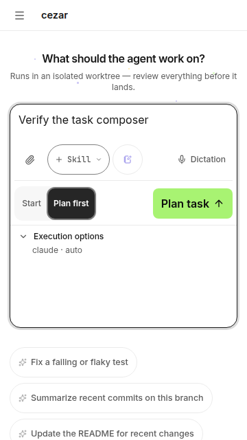
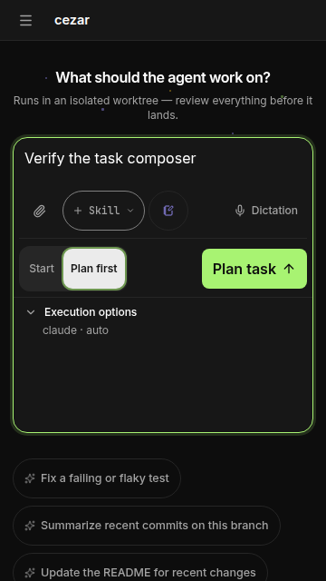
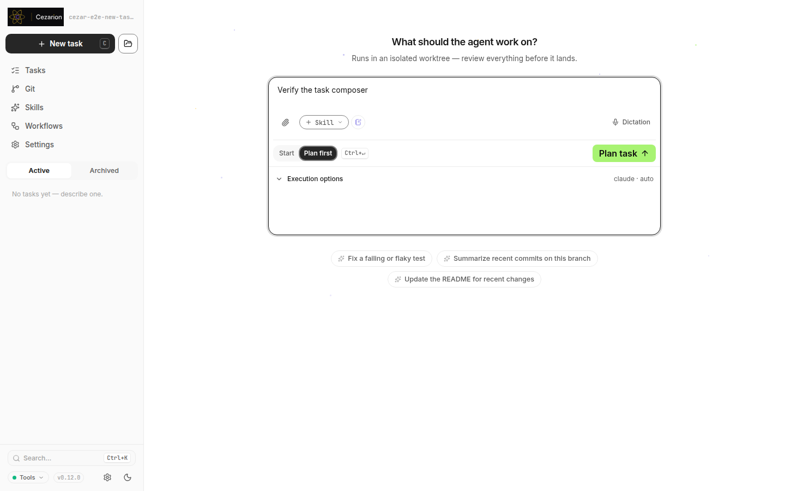
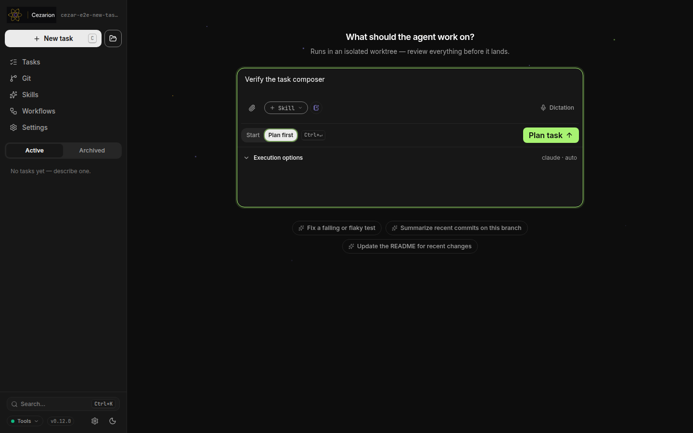
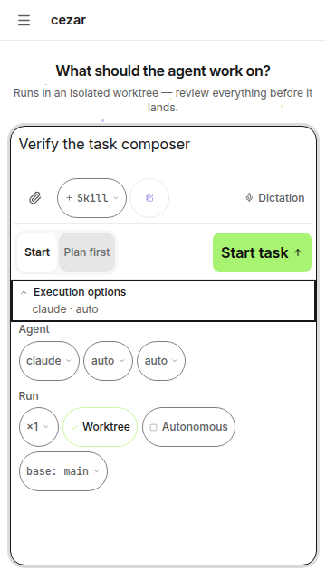

# New Task composer hierarchy — issue #168

The supervisor approved this bounded design: prompt/context first, a separate Start/Plan first and submission row, and an accessible execution-options disclosure showing the resolved agent/model. It uses the existing tokens and controls, adds no artwork or animation, and keeps one mounted composer and mounted execution controls across disclosure and viewport changes.

Audience: developers assigning coding tasks, including one-handed phone use. The job is to describe and launch a task while retaining access to every execution choice. Success means prompt entry and submission are easy to identify before opening settings.

## Acceptance evidence

| Criterion | Evidence |
| --- | --- |
| Separate prompt, execution options, and submission | `new-task-hierarchy.e2e.ts` measures the vertical order of prompt, context, submission, and disclosure. Screenshots below show collapsed and expanded states. |
| Preserve options, defaults, and submission semantics | `new-task.test.tsx` checks exact plain/skill/workflow/variant payloads, account/model/effort resolution, provider gates, and Plan first. Existing New Task, Plan mode, composer-defaults, and thread-composer browser suites pass. No mutation handlers or defaults changed. |
| Drafts, attachments, selections survive responsive layout | The new browser test changes variants, selects a skill, attaches `notes.txt`, and switches 360→1440→360. It verifies the same prompt/model DOM nodes, draft text, attachment, and selections through repeated disclosure toggles, then submits successfully. The component test also changes the model and checks the summary updates. |
| 360×640 fit | All visible composer buttons and the disclosure measure at least 44×44 CSS px in comfortable, compact, and ultra density; no horizontal overflow or controls clipped by the viewport, expanded or collapsed. |
| Clear focus and action states in both themes and reduced motion | Browser matrix covers 360×640 and 1440×900 × light/dark × comfortable/compact/ultra × normal/reduced motion (24 cases). Each checks actual theme/media state, keyboard focus outline, Space/Enter disclosure activation, and Start/Plan first selection and enabled submission. |
| Criterion-by-criterion QA | This table plus the committed browser suite and screenshots. |

## Preserved states

Loading/provider gates, empty prompt behavior, templates, dictation, plan review, and normal navigation retain their existing paths. Pending submission makes prompt/attachments read-only, disables submit, and makes the new disclosure inert. A delayed HTTP 503 browser test proves duplicate protection, retained draft/error guidance, and unchanged composer height through pending/error. Unit regressions retain newer-draft protection and late-result handling across ordinary, planned, bookmarklet, and dictation submissions.

Regression evidence: before implementation, the new component test failed because Execution options was absent; the real-browser baseline failed with zero disclosure elements. The implemented layout passes. Browser visibility uses native `checkVisibility()` because the provider's generic visibility query reports descendants of closed native details as visible. Menu tests wait for the existing Radix exit transition before the next interaction.

Browser QA used the real built cockpit with isolated dry-run fixture servers and a real Chrome session. Theme/density overrides were browser-local; reduced motion used browser media emulation. Screenshots were visually inspected. This is desktop-browser viewport emulation, not native phone-keyboard or microphone-hardware QA; dictation coverage uses the existing scripted recognition adapter.

## Captures

## Verification

- `TMPDIR=/tmp npm run typecheck` → passed.
- `TMPDIR=/tmp npm test -- --maxWorkers=2` → 376 files, 7,821 tests passed.
- `TMPDIR=/tmp npm run test:unit` → 177 tests passed.
- `TMPDIR=/tmp npm run build` → passed; package inventory: 555 files.
- `TMPDIR=/tmp npm run test:package` → 24 tests passed.
- `TMPDIR=/tmp AGENT_BROWSER_ARGS=--no-sandbox AGENT_BROWSER_SOCKET_DIR=/tmp/ab168 XDG_RUNTIME_DIR=/tmp/rt168 npm test -- --config packages/web/e2e/vitest.config.ts --maxWorkers=1 new-task-hierarchy.e2e.ts new-task.e2e.ts plan-mode.e2e.ts composer.e2e.ts composer-defaults.e2e.ts` → five files, 50 browser tests passed.

SDLC documentation check: no process, workflow, API, or configuration changes; no SDLC documentation update needed.

## Review integration follow-up

The existing touch-target and selection-state suites now open Execution options before measuring or interacting with its controls; the general mobile target/overlap scan also opens it. The execution group retains the original card background. Their contrast, disabled-state, selection, overlap, and edge-hit assertions remain in place.

The supervisor confirmed that the intended labeled submit button may be wider than 44px. Its obsolete exact-square assertion now checks both minimum dimensions, and the enabled labeled button additionally receives the suite's five-point hit test. Its measured width was about 120px at comfortable density, with no clipping; the label remains visible.

`TMPDIR=/tmp AGENT_BROWSER_ARGS=--no-sandbox AGENT_BROWSER_SOCKET_DIR=/tmp/ab168 XDG_RUNTIME_DIR=/tmp/rt168 npm test -- --config packages/web/e2e/vitest.config.ts --maxWorkers=1 touch-targets.e2e.ts selection-states.e2e.ts new-task-hierarchy.e2e.ts` → 3 suites, 68 tests passed against the final production build. Captures above were refreshed from that run. Before the correction, the focused integration run failed three cases (old square-width expectation and control-background contrast sampling).

All five repository gates were rerun for this follow-up: typecheck passed; 7,821 Vitest tests, 177 core tests, production build/package inventory, and 24 packaged CLI tests passed.
